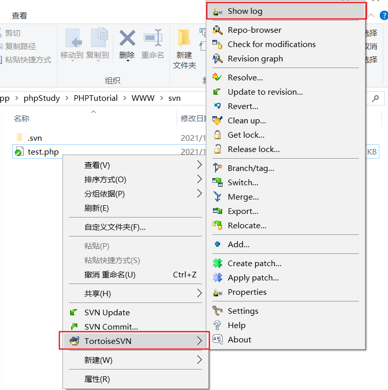
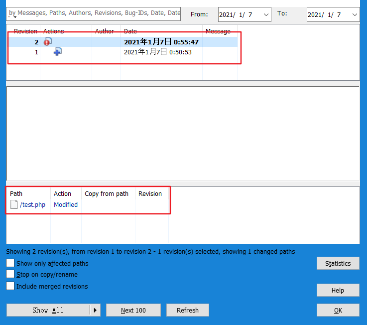
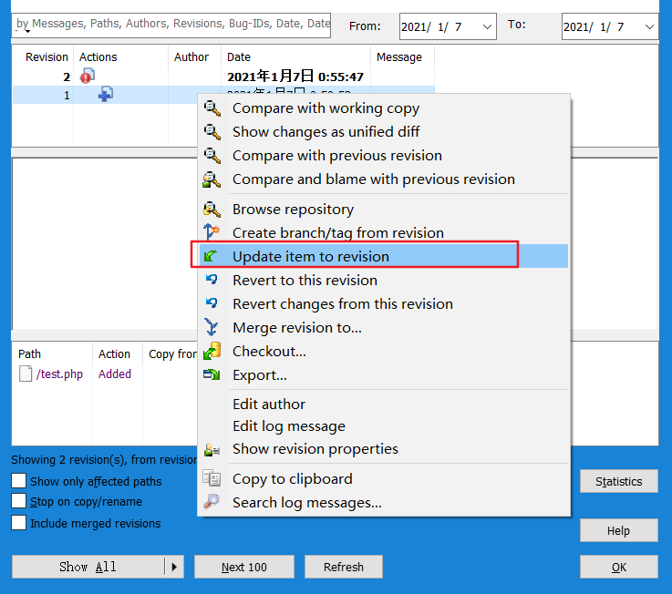
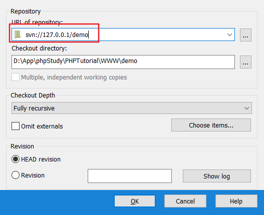

# SVN服务端仓库配置(Windows)

1.创建仓库的总目录

`D:\SVN\web`

2.创建仓库的某个项目的目录

`D:\SVN\web\shop`

3.创建仓库

cmd模式下:

`C:\Users\sjs>svnadmin create D:/SVN/web/shop`

4.启动SVN服务

`C:\Users\sjs>svnserve -d -r D:/SVN/web/shop`

-d 指定后台方式使用Windows下无效

-r 指定SVN服务端启动后要监管的仓库

# SVN客户端使用

## 使用流程

1.在客户端的SVN先进行检出(`SVN checkout`)操作。检出是为了和服务端的SVN建立连接并获得代码。

2.当文件为第一次上传时，需先使用SVN客户端把文件添加到上传队列`(TortoiseSVN>Add`)。

3.提交(`SVN Commit...`)代码到SVN的服务端。

4.如果要获取SVN服务端上的最新的代码，需进行更新(`SVN Update`)操作。

## 错误处理

错误提示：`Error	Authorization failed`

该错误是因为SVN默认开启了匿名用户只能访问不能写入，需修改SVN服务端上的仓库配置文件`D:\SVN\web\shop\conf`，设置匿名用户可以写入`anon-access = write` ，然后重启SVN服务生效。

## 冲突处理

产生冲突的原因：

A和B同时在9点更新获取了SVN服务端上的同一份代码index.php，A在15点提交了修改后的代码index.php，B在18点提交了修改后的代码ilndex.php，由于B的代码index.php不是SVN服务端上最新的，此次提交就会产生冲突。

由最后提交的B处理，此时在B电脑上的SVN客户端项目里有4个文件：

index.php：包含了完整的代码数据，此文件里的代码语法是有问题的，需要手动调整。

index.php.mine：B自己所编写的代码文件。

index.php.r2：上上一个版本对应的代码文件 ，2为版本号。

index.php.r2：上一个版本的代码文件，3为版本号。

解决冲突的办法：

1.修改index.php文件里的语法问题。

2.删除其他3个文件index.php.mine、index.php.r2、index.php.r2，然后再提交。

## 版本回退

1.进入日志



2.查看日志



3.更新到指定版本



# SVN服务端多仓库配置(Windows)

1.创建另一个项目的仓库目录

`D:\SVN\web\demo`

2.创建仓库

`C:\Users\sjs>svnadmin create D:/SVN/web/demo`

3.监管仓库

C:\Users\sjs>svnserve -d -r D:/SVN/web

4.使用SVN客户端检出demo项目的代码



# SVN帐号设置

1.修改SVN服务端上的passwd文件

D:\SVN\web\shop\conf\passwd

```
[users]
# harry = harryssecret
# sally = sallyssecret
admin = 12345
```

2.修改SVN服务端上的svnserve.conf

D:\SVN\web\shop\conf\svnserve.conf

```
auth-access = write 
password-db = passwd 
authz-db = authz 
```

3.修改SVN服务端上的authz文件

D:\SVN\web\shop\conf\authz

```
[/]
admin = rw
```

4.重启SVN服务